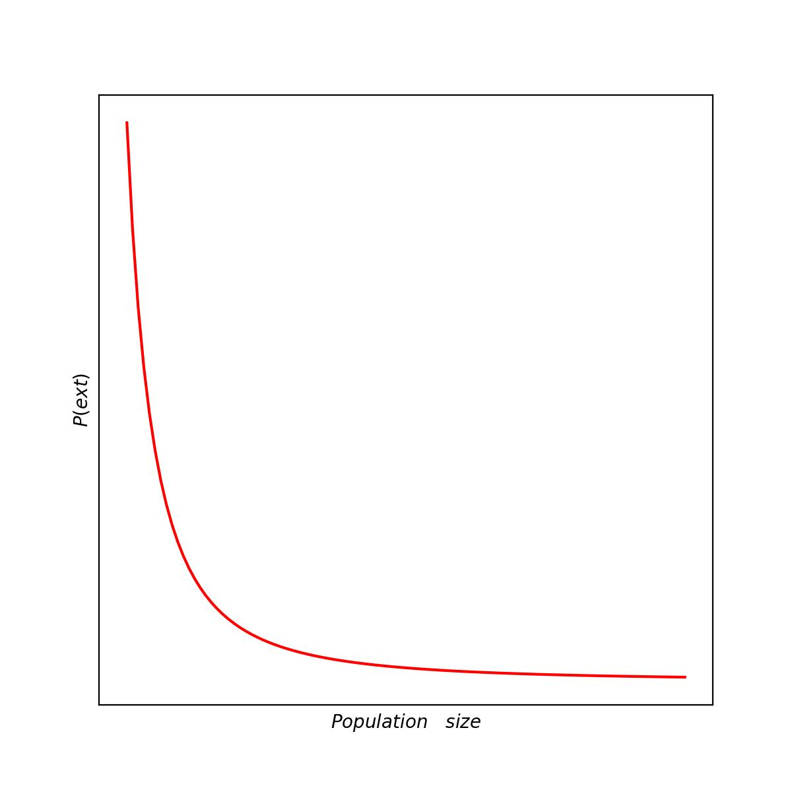

# ___Why is Abundance Important___
----------------

## ___The importance of counting.___
--------------

- ### ___The varieties of species present in a habitat confers many environmental benefits to an ecosystem (like enhanced resilience to environmental hazards).___

- ### ___Abundance focuses on the number of animals in a quantitative sense. Consider the role of a single individual (a unicellular diatom, a filamentous bacteria, a thalloid algae, a zooplankton, a lobster, etc..). In an ecosystem, the functions that a group of species perform in an environment is directly related to how many members of that group are carrying out that function. If we ease the number of indals, the functionality also increases. e.g. more pollinators lead to more pollination, more predators lead to more predation etc..___

- ### ___It is suprisingly difficult to get accurate estimates of species in natural environments. The principal challenge is that to avoid one animal from another from the same species to avoid double counting. This may appear like a simple problem.___

- ### ___This typically involves, marking the caught animals, releasing them back to the environment & then observing the relative frequency of the marked individuals from which the population size is estimated. Due to the high time and effort required by this method, this is rarely done for most species unless there's a conservation need.___

- ### ___However, this method has been applied to birds, where individual birds have been captured, tagged (leg rings) and resighted/recaptured to study changes in their populations. Tagging (like marking numbers/labels on wings) is alos possible for larger insects. (like dragonflies, damselflies etc..)___

- ### ___Links between species in ecological networks is critical to the existence of the ecosystem. Considering feeding links, where one species is a resource and the other is the consumer, the strength of this interaction is dependent on the abundances of both groups of species. Too many resources and too little consumers leads to explosive growth of the resource population while too many consumers and too little resources will result in the resource opulation being eaten to extinction. Thus ecological networks require string and robust interactions to sustain healthy ecosystems.___

- ### ___But there are various interests to conserve population sizes (number of individuals in a species) in addition to the number of individuals in the whole habitat. Number of organisms in a population is directly related to the genetic diversity in that population. The more individuals present in a population, the more chances we have to have a diverse genotypes.___

- ### ___In conservation strategies, a rule of thumb is used to decide which is a viable population,___

    - Populations that have been reduced to fewer than 50 individuals globally are already doomed for extinction.
    
    - Species with higher abundance but very lower genetic diversity might also be considered beyond hope. (These species lack the genetic diversity to avoid inbreeding & to withstand environmental challenges as a resilient species).

- ### ___As a species declines in population, it starts to enter a phase known as the extinction vortex. This vortex is a concept used to describe how small populations are more sensitive to random changes such as random fluctuations, and the male/female ratio than larger populations.___

- ### ___This slow death, (functional extinction) is faced by many species that only exist in zoos or is very small numbers in the wild.___