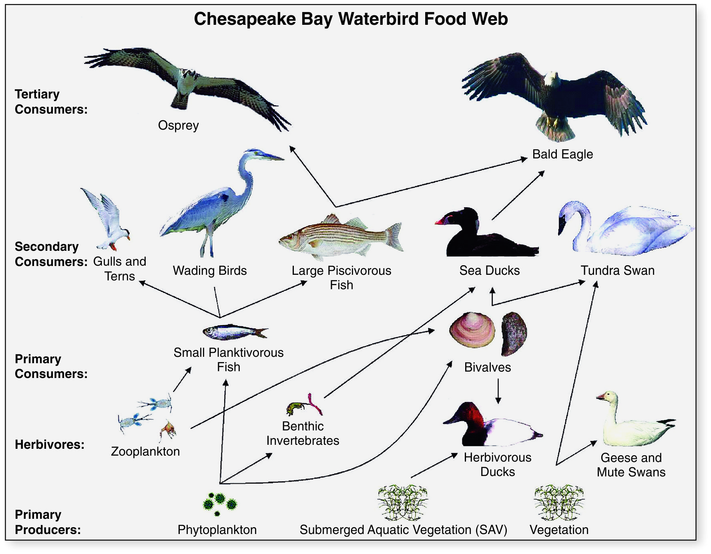

# ___Why is Diversity Important?___
-----------------

- ___The importance of quantifying the diversity organisms found in the environment.___

- ___Biodiversity manifests itself in different scales.___
    - Diversity among species.
    - Diversity within species.
    - Diversity among different habitats.
    
### ___Taxonomic diversity___
----------------

- ___Diversity between different types of organisms (inter-specific diversity).___

- ___Ecological networks function by facilitating enough interactions between species, such that their needs are met.___

- ___Having intra-specific diversity adds to the redundancy in the ecological networks. This redundancy improves the resiliency of networks and makes then less sensitive to the loss of any on particular species, since the available set of closely related infra-specific taxa can easily fill the vacated niche.___

- ___Each species lsted here is reliant on at least one other species in this network for their continued existence. Even the species at the bottom of the food web (primary producers), that do not seem to feed on others, depend on the ecological processes facilitated by others. (e.g. ecosystem services, biogeochemical cycles, nutrient recycling)___

- ___Loss of biodiversity can break links in the foodweb and can ultimately, lead to the collapse of the ecosystems.___

### ___Intra-specific genetic diversity___

- ___This level of diversity is difficult to perceive since these do not generally manifest themselves in noticeable visual differences. This diversity is best explained by the plants and cattle we rely on for our food.___

- ___Around 12,000 years ago, during the first agricultural revolution, humans transitioned from hunter-gatherers to agricultural settlers/pastoralists. This transition was made possible by the domestication of a relatively small number of human food species.___

- ___All apecies are always at risk from diseases/environmental hazards. If one species we depend on food is to suffer such a fate, then the mankind will be forced to face famine. To mitigate such threats, is to maintain a diversity of genotypes within our domesticated species, such that the ecosystem can recover and regain its functionality helped by the diverse species filling the niches left by the lost species.___

### ___Resilience___

- ___Diversity confers the ablity to resist environmental chalenges or other challenges at a genetic scale and at a taxonomic scale.___